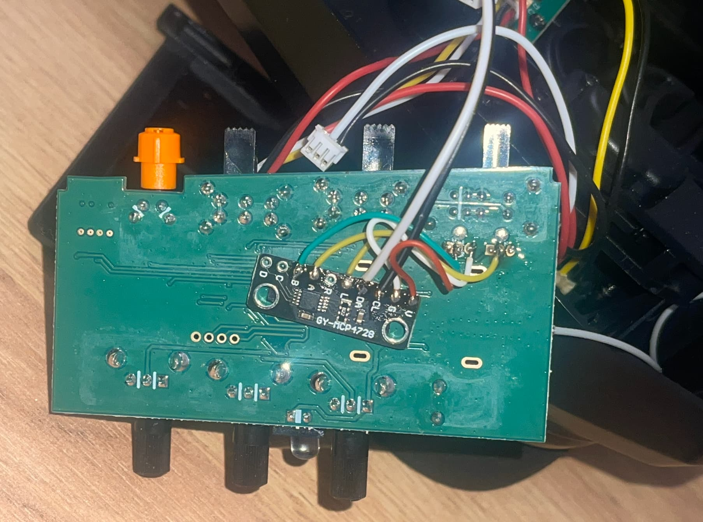
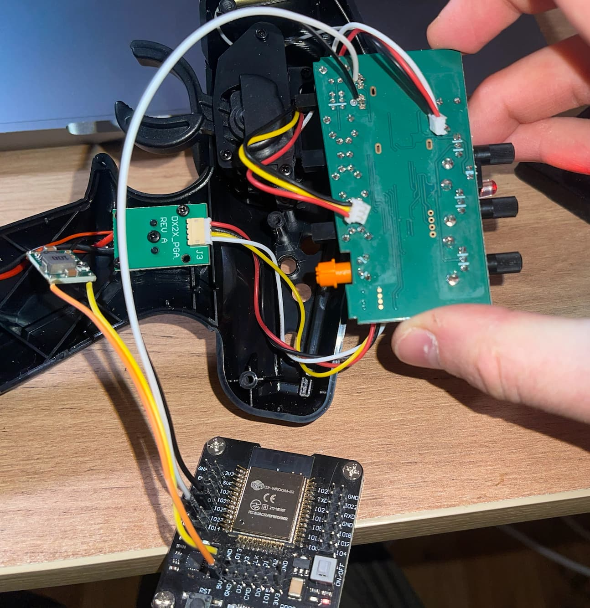
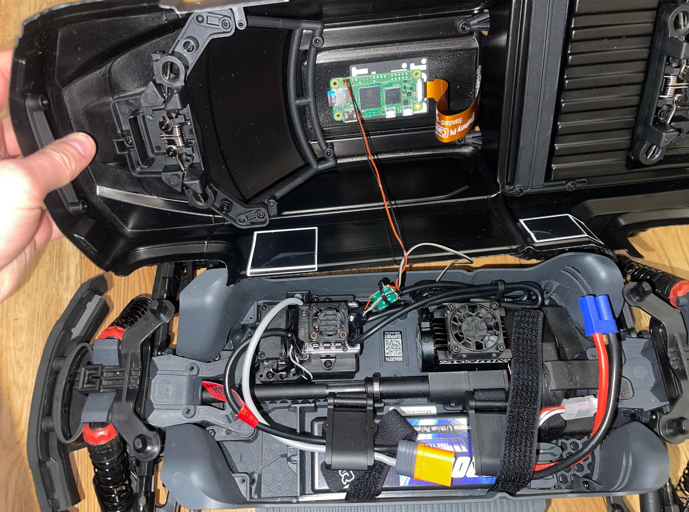
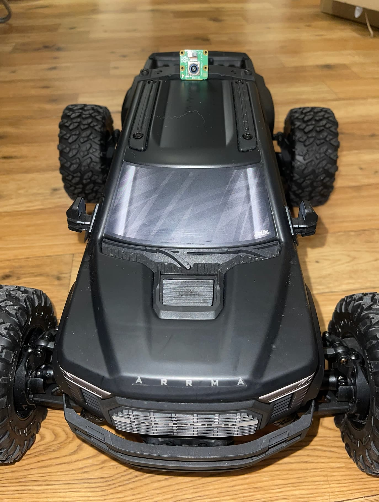
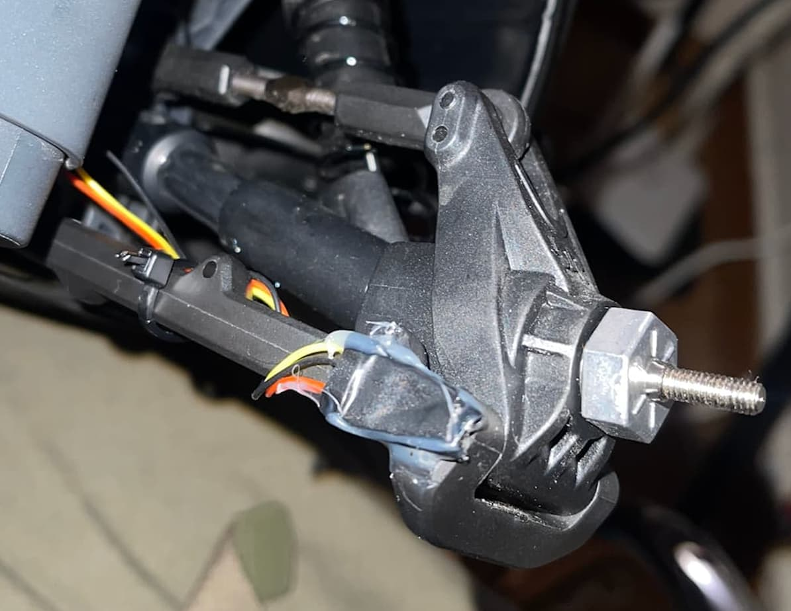
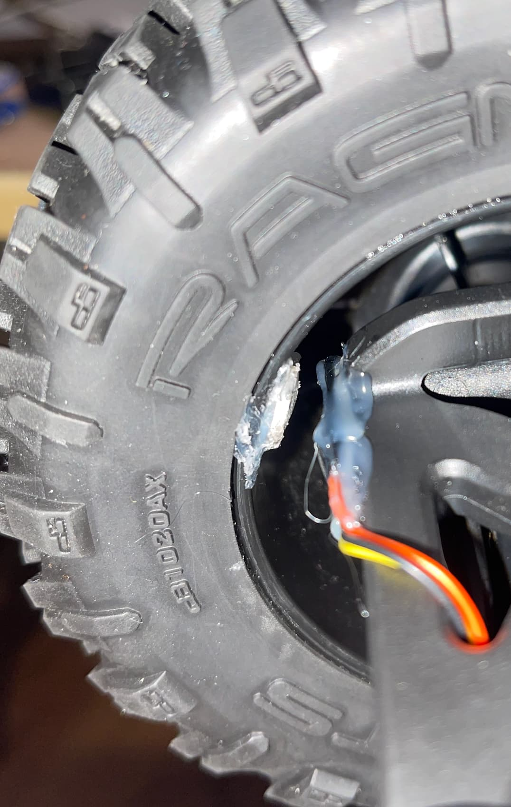
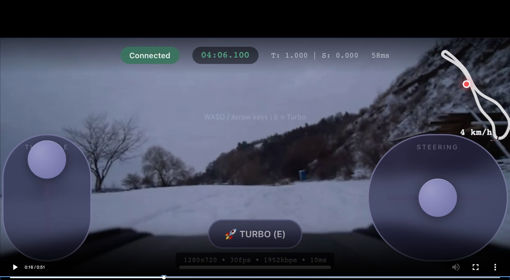
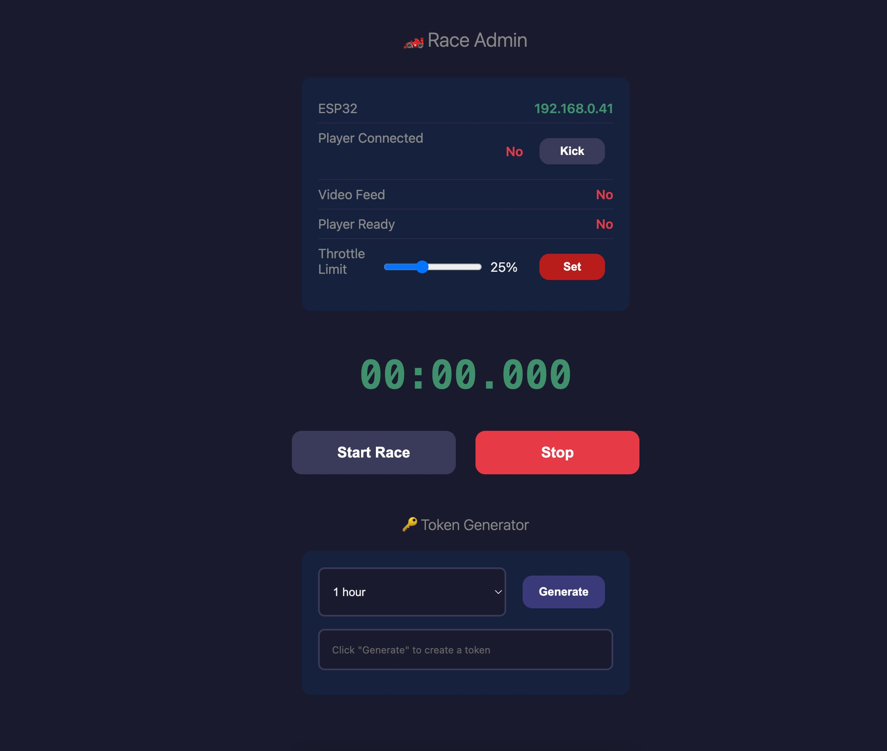
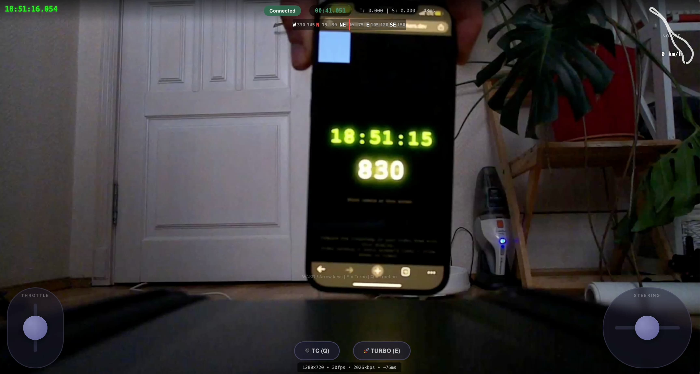

# Tether Rally - Remote Control RC Car Over the Internet

Drive a real RC car from anywhere in the world through your browser. Experience low-latency control (~30-100ms over 4G) with live first-person video streaming, powered by WebRTC peer-to-peer technology.

|                         |                         |
| :---------------------: | :---------------------: |
|   |   |
|   |   |
|  |  |
|   |   |
|  |                         |

## Overview

The system streams 720p @ 60fps video from a camera mounted on the car while you control it through a web interface. A Raspberry Pi handles video streaming and relays your control inputs. For cars with integrated ESC/receivers (like ARRMA), an ESP32 with a DAC simulates joystick inputs on the transmitter.

```
┌─────────────┐      WebRTC       ┌─────────────┐      WiFi/UDP      ┌─────────────┐
│   Browser   │ ◄───────────────► │ Raspberry Pi│ ◄────────────────► │    ESP32    │
│  (Control)  │   Video + Data    │  (on car)   │   Control relay    │(transmitter)│
└─────────────┘                   └─────────────┘                    └─────────────┘
                                        │
                                   Camera Module
                                   720p @ 60fps
```

**Latency:** ~30-100ms control (internet), ~150ms video glass-to-glass over 4G

---

## Features

### Core

- **Low-latency control** — ~30-100ms over internet, ~10-15ms on LAN
- **Live FPV video** — 720p @ 60fps H.264 streaming
- **Gamepad support** — Steam Deck, Xbox, PlayStation controllers via Gamepad API
- **Touch & keyboard controls** — Works on mobile and desktop
- **Auto-reconnect** — Handles connection drops gracefully

### Driving Assists

- **Turbo mode** (E key) — Boost from 30% → 65% forward throttle
- **Traction control** (Q key) — IMU + wheel RPM slip detection with auto throttle limiting
- **Stability control** (R key) — Yaw-rate based oversteer/understeer intervention
- **ABS** (B key) — Anti-lock braking with ESC state machine for controlled stops
- **Hill Hold** (G key) — Automatic brake hold on inclines with pitch detection
- **Coast Control** (N key) — Throttle injection during coasting to prevent rollback
- **Surface Adaptation** (F key) — Dynamic grip estimation for threshold adjustment
- **Steering shaper** — Speed-based steering limits and counter-steer assist

### Telemetry

- **GPS** — Real-time position, speed (km/h), and heading
- **IMU compass (BNO055)** — Stable heading even when stopped
- **Hall effect wheel sensor** — RPM and distance tracking
- **Track map overlay** — Mini-map showing live car position
- **Back camera PiP** — Optional rear view from IP camera (RTSP via MediaMTX)
- **Debug overlay** (C key) — Real-time stability system telemetry

### Race Management

- **Admin dashboard** — Race management, player monitoring
- **Race state machine** — Countdown → racing → stop flow
- **Token-based access** — Secure, time-limited access tokens
- **YouTube Live streaming** — Stream directly from admin dashboard

### Safety

- **Throttle limits** — Enforced on the car, not browser
- **Headlight control** (H key) — GPIO-controlled via MOSFET

---

## How It Works

This project was designed for **ARRMA vehicles** with integrated ESC/receivers (Big Rock, Granite, Senton, etc.) where you can't tap into the receiver directly. The workaround: an ESP32 on the transmitter generates analog voltages that mimic joystick movements.

**For standard RC cars** with separate receivers, you can simplify by controlling servos/ESC directly from the Pi using PWM — no ESP32 or transmitter needed.

---

## Hardware

### On the RC Car

| Component                 | Purpose                 | Est. Cost |
| ------------------------- | ----------------------- | --------- |
| Raspberry Pi Zero 2W      | Video streaming + relay | ~$15      |
| Pi Camera Module 3 (Wide) | FPV camera              | ~$35      |
| GPS Module (optional)     | Speed & position        | ~$10      |
| BNO055 IMU (optional)     | Compass & stability     | ~$10      |
| A3144 Hall Sensor (opt.)  | Wheel RPM & distance    | ~$2       |
| IP Camera (optional)      | Rear view PiP           | ~$15-30   |

**Power:** ARRMA Big Rock ESC has 5V output pins that can power the Pi directly.

### On the Transmitter (ARRMA setup)

| Component         | Purpose                    | Est. Cost |
| ----------------- | -------------------------- | --------- |
| ESP32 or ESP32-C3 | Receives UDP, controls DAC | ~$5-10    |
| MCP4728 DAC       | 12-bit analog output       | ~$5       |

**Total:** ~$60-80 depending on optional sensors

## Software Requirements

- **Arduino IDE** — For ESP32 firmware
- **Node.js 18+** — For Cloudflare deployment
- **Cloudflare Account** — Free tier (Workers, Tunnel, TURN)

---

## Quick Start

### 1. ESP32 Setup

1. Copy `main/config.h.example` → `main/config.h` and add your WiFi credentials
2. Install `Adafruit MCP4728` library in Arduino IDE
3. Upload `main/main.ino` to your ESP32
4. The ESP32 will broadcast a beacon on UDP port 4211

### 2. Raspberry Pi Setup

1. Flash **Raspberry Pi OS Lite (64-bit)** and enable SSH
2. Install dependencies:
   ```bash
   sudo apt update && sudo apt install -y python3-pip
   pip3 install aiortc aiohttp pyyaml pyserial pynmea2
   ```
3. Install [MediaMTX](https://github.com/bluenviron/mediamtx) for video streaming
4. Install [cloudflared](https://github.com/cloudflare/cloudflared) and create a tunnel
5. Deploy `control-relay.py` as a systemd service

### 3. Cloudflare Setup

1. Get TURN credentials from Cloudflare Dashboard → Calls → TURN Keys
2. Deploy the Worker:
   ```bash
   cd arrma-relay && npm install
   npx wrangler secret put TURN_KEY_ID
   npx wrangler secret put TURN_KEY_API_TOKEN
   npm run deploy
   ```
3. Copy `public/config.js.example` → `config.js` and configure your URLs

### 4. Generate Access Token

```bash
TOKEN_SECRET="your-secret-key" node generate-token.js 60
```

See [SETUP.md](SETUP.md) for detailed configuration instructions.

---

## Usage

1. Power on the RC car (ESP32 and Pi should auto-connect to WiFi)
2. Wait ~30 seconds for services to start
3. Open your Worker URL in a browser
4. Enter the access token
5. Once video connects, click "Ready"
6. Wait for admin to start the race (3-2-1-GO countdown)
7. Drive!

### Controls

#### Gamepad (Steam Deck / Xbox / PlayStation)

| Input                      | Action            |
| -------------------------- | ----------------- |
| Right Trigger (RT/R2)      | Throttle/Forward  |
| Left Trigger (LT/L2)       | Brake/Reverse     |
| Left Stick (horizontal)    | Steering          |
| A (Xbox) / X (PS)          | Toggle Turbo      |
| B (Xbox) / O (PS)          | Toggle Traction   |
| X (Xbox) / □ (PS)          | Toggle Stability  |
| Y (Xbox) / △ (PS)          | Toggle ABS        |
| LB/L1                      | Toggle Hill Hold  |
| RB/R1                      | Toggle Coast      |
| D-pad Up                   | Toggle Surface    |
| D-pad Down                 | Toggle Headlights |
| Start/Menu                 | Debug Overlay     |

#### Keyboard

| Input                      | Action            |
| -------------------------- | ----------------- |
| W / ↑                      | Forward           |
| S / ↓                      | Reverse           |
| A / ←                      | Steer left        |
| D / →                      | Steer right       |
| E                          | Toggle Turbo      |
| Q                          | Toggle Traction   |
| R                          | Toggle Stability  |
| B                          | Toggle ABS        |
| G                          | Toggle Hill Hold  |
| N                          | Toggle Coast      |
| F                          | Toggle Surface    |
| H                          | Toggle Headlights |
| C                          | Debug Overlay     |

#### Touch (Mobile)

| Input                      | Action            |
| -------------------------- | ----------------- |
| Left zone drag up/down     | Throttle          |
| Right zone drag left/right | Steering          |

### Admin Dashboard

Access `/admin.html` (requires basic auth) to:

- Monitor ESP32 status and player connection
- Set throttle limits (10-50%)
- Start/stop races with countdown
- Kick players and revoke tokens
- Generate new access tokens
- Control YouTube Live streaming

---

## Safety

- **Throttle limits** — Admin-adjustable 10-50%, ESP32 hard limit 50% forward / 30% reverse
- **Traction control** — Automatic slip detection with throttle limiting (max 30% cut)
- **Auto-neutral** — Car stops if connection lost (80ms hold, then neutral)
- **Slew rate limiting** — Prevents sudden jerky movements
- **Token expiration** — Tokens expire automatically
- **Race state control** — Controls blocked until admin starts race

---

## Troubleshooting

| Problem              | Solution                                                                                      |
| -------------------- | --------------------------------------------------------------------------------------------- |
| ESP32 not discovered | Check WiFi credentials, ensure same network as Pi, test beacon: `nc -ul 4211`                 |
| Video not connecting | Check MediaMTX: `systemctl status mediamtx`, test WHEP: `curl http://localhost:8889/cam/whep` |
| Controls not working | Verify token is valid, check relay: `journalctl -u control-relay -f`                          |
| High latency         | Use 5GHz WiFi, check if using TURN relay vs P2P (browser console), reduce video bitrate       |

---

## Project Structure

```
arrma-remote/
├── main/                    # ESP32 firmware
│   ├── main.ino
│   └── config.h.example
├── arrma-relay/             # Cloudflare Worker
│   ├── src/index.ts
│   └── public/              # Web UI (index.html, admin.html)
├── pi-scripts/              # Raspberry Pi scripts
│   ├── control-relay.py     # WebRTC → UDP relay
│   ├── bno055_reader.py     # IMU driver
│   ├── hall_rpm.py          # Wheel RPM reader
│   ├── low_speed_traction.py # Traction control (launch/cruise phases)
│   ├── abs_controller.py    # ABS with ESC state machine
│   ├── hill_hold.py         # Hill hold with pitch detection
│   ├── coast_control.py     # Coast throttle injection
│   ├── surface_adaptation.py # Dynamic grip estimation
│   └── deploy.sh            # Quick deploy to Pi
├── restreamer/              # YouTube restreamer (Go/Fly.io)
├── generate-token.js        # Access token generator
├── SETUP.md                 # Detailed setup guide
└── PLAN.md                  # Architecture & roadmap
```

---

## Technical Reference

<details>
<summary><strong>Binary Protocol</strong></summary>

Packet format: `seq(uint16 LE) + cmd(uint8) + payload`

| Command  | Code | Payload                              | Description                     |
| -------- | ---- | ------------------------------------ | ------------------------------- |
| PING     | 0x00 | timestamp(4)                         | Latency measurement             |
| CTRL     | 0x01 | throttle(2) + steering(2)            | Control values ±32767           |
| PONG     | 0x02 | timestamp(4)                         | Latency response                |
| RACE     | 0x03 | sub-cmd(1)                           | Race start/stop commands        |
| STATUS   | 0x04 | sub-cmd(1) + value(1)                | Browser→Pi status               |
| CONFIG   | 0x05 | reserved(1) + turbo(1) + traction(1) | Pi→Browser config               |
| KICK     | 0x06 | —                                    | Pi→Browser: kicked notification |
| TELEM    | 0x07 | (37 bytes)                           | Pi→Clients: telemetry           |
| TURBO    | 0x08 | turbo(1)                             | Turbo mode toggle               |
| TRACTION | 0x09 | traction(1)                          | Traction control toggle         |

</details>

<details>
<summary><strong>Data Flow Latencies</strong></summary>

| Path                 | LAN      | Internet |
| -------------------- | -------- | -------- |
| Browser → Pi → ESP32 | ~10-15ms | ~40+ms   |
| Video (Pi → Browser) | ~120ms   | ~150+ms  |

</details>

<details>
<summary><strong>ESP32 Wiring</strong></summary>

**ESP32 to MCP4728 DAC:**

```
# ESP32-WROOM DevKit:
GPIO 21 (SDA) → MCP4728 SDA
GPIO 22 (SCL) → MCP4728 SCL

# ESP32-C3 Super Mini:
GPIO 8 (SDA)  → MCP4728 SDA
GPIO 9 (SCL)  → MCP4728 SCL

# Common:
3.3V → MCP4728 VCC
GND  → MCP4728 GND
MCP4728 LDAC → GND
```

**MCP4728 to Transmitter:**

```
VoutA → Throttle joystick wiper
VoutC → Steering joystick wiper
GND   → Transmitter GND (common ground!)
```

</details>

<details>
<summary><strong>Optional Sensors Wiring</strong></summary>

**GPS Module (NEO-6M/7M/BN-220):**

- TX → Pi GPIO 15 (RX)
- VCC → 3.3V or 5V (depends on module)
- GND → GND

**BNO055 IMU:**

- SDA → Pi GPIO 2
- SCL → Pi GPIO 3
- VCC → 3.3V
- GND → GND
- Mount with Y axis pointing forward

**A3144 Hall Sensor:**

- Signal → Pi GPIO 22 (internal pull-up)
- VCC → 3.3V
- GND → GND
- Mount magnet on wheel hub, sensor ~2-5mm away

</details>

<details>
<summary><strong>ARRMA Voltage Mapping</strong></summary>

| Control  | Voltage Range                     | Neutral |
| -------- | --------------------------------- | ------- |
| Throttle | 1.20V (reverse) → 2.70V (forward) | ~1.71V  |
| Steering | 0.35V (right) → 2.95V (left)      | ~1.71V  |

</details>

---

## License

MIT License — See [LICENSE](LICENSE) for details.

## Contributing

Contributions welcome! Please read [PLAN.md](PLAN.md) for architecture details and roadmap.

## Acknowledgments

- [aiortc](https://github.com/aiortc/aiortc) - Python WebRTC
- [MediaMTX](https://github.com/bluenviron/mediamtx) - Media streaming server
- [Cloudflare](https://cloudflare.com) - TURN, Workers, and Tunnel services

## Support

If you find this project exciting, consider supporting my work with a small donation

<a href="https://www.buymeacoffee.com/romanliutikov">

</a>
