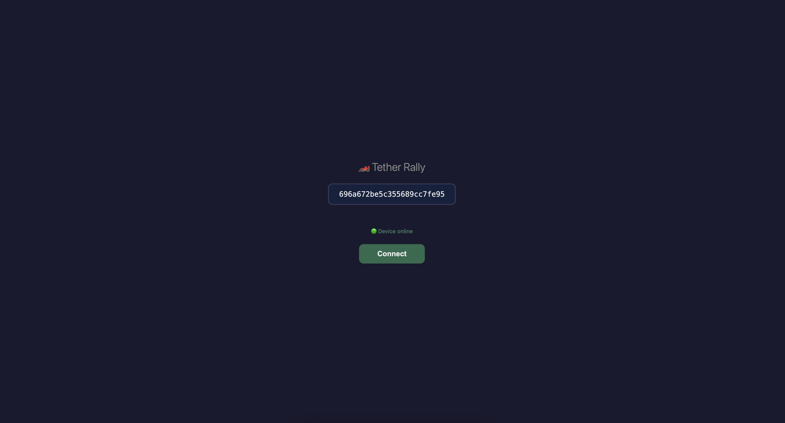
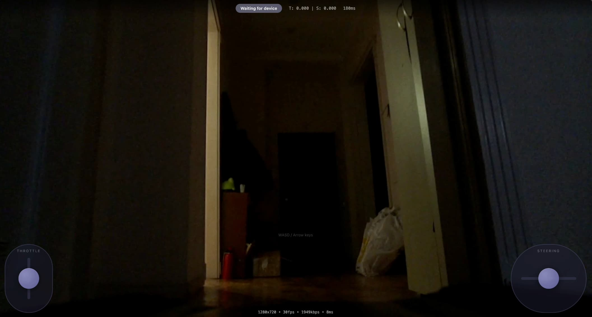

# Tether Rally - Remote Control RC Car Over the Internet

Control a real RC car from anywhere in the world through your browser. This project enables low-latency remote control (~100-200ms) with live FPV video streaming, using WebRTC for peer-to-peer communication.

|                        |                        |
| :--------------------: | :--------------------: |
|  |  |
|  |  |
|  |  |

## Features

- **Low-latency control** - ~100-200ms over internet, ~10-15ms on LAN
- **Live FPV video** - 720p @ 30fps H.264 streaming
- **Touch & keyboard controls** - Works on mobile and desktop (smooth interpolation)
- **Token-based access** - Secure, time-limited access tokens
- **Auto-reconnect** - Handles connection drops gracefully
- **Safety limits** - Throttle limits enforced on the car (not browser)
- **Admin dashboard** - Race management, player monitoring, kick functionality
- **Race state machine** - Countdown → racing → stop flow
- **Adjustable throttle** - Admin can set 10-50% limit in real-time
- **Player ready system** - Player must confirm ready before race starts
- **YouTube Live streaming** - Stream to YouTube from admin dashboard (Fly.io restreamer)
- **Live telemetry overlay** - Race time, throttle & steering displayed on YouTube stream
- **GPS telemetry** - Real-time position, speed (km/h), and heading from GPS module
- **Track map overlay** - Mini-map showing live car position on configurable track image

## How It Works

**For ARRMA Big Rock (2-in-1 ESC/Receiver):**

```
Browser ──WebRTC──> Pi (on car) ──WiFi/UDP──> ESP32 (on transmitter) ──DAC──> Transmitter ~~Radio~~> Car
                      │
                      └──WebRTC Video──> Browser
```

**For standard RC cars (direct control):**

```
Browser ──WebRTC──> Pi (on car) ──PWM──> Servo/ESC
                      │
                      └──WebRTC Video──> Browser
```

1. **Browser** sends control commands at 50Hz via WebRTC DataChannel
2. **Cloudflare TURN** provides NAT traversal for P2P connection
3. **Raspberry Pi** (mounted on car) relays commands and streams video
4. **ESP32** (on transmitter, for ARRMA) generates analog voltages mimicking joystick input
5. **Transmitter** sends radio signal to car's integrated receiver/ESC

## Hardware Requirements

### Architecture Note: Why ESP32 + Transmitter?

This project was specifically designed for **ARRMA Big Rock** (and similar ARRMA vehicles) with **2-in-1 ESC/Receiver modules**. These integrated units have no accessible input pins - the receiver is permanently coupled to the ESC with no way to inject control signals directly.

**The workaround:**

```
Internet → Pi (on car) → WiFi → ESP32 (on transmitter) → DAC voltages → Transmitter joystick inputs → Radio → Car receiver/ESC
```

The ESP32 sits on the **transmitter** (not the car), generating analog voltages that mimic joystick movements. The transmitter then sends these as normal radio signals to the car.

**For most other RC cars**, you can simplify this significantly:

- If your car has a **separate receiver with PWM outputs**, you can control servos/ESC directly from the Pi using GPIO PWM - no ESP32 or transmitter needed
- If your car has **standard servo connectors**, use a Pi with PCA9685 PWM driver or direct GPIO

This project can be adapted for direct Pi control by modifying `control-relay.py` to output PWM instead of UDP.

### Components

**On the RC Car:**

| Component                 | Purpose                 | Est. Cost |
| ------------------------- | ----------------------- | --------- |
| Raspberry Pi Zero 2W      | Video streaming + relay | ~$15      |
| Pi Camera Module 3 (Wide) | FPV camera              | ~$35      |
| GPS Module (optional)     | Speed & position data   | ~$10      |

**Power:** The ARRMA Big Rock ESC has 5V output pins (intended for cooling fans) that can power the Raspberry Pi directly. Connect to GPIO 5V and GND pins. For other setups, use a USB power bank (5V 2A+).

**GPS Module (optional):** Any NMEA-compatible GPS module with serial output (e.g., NEO-6M, NEO-7M, BN-220). Connect TX to Pi GPIO 15 (RX), and power from Pi 3.3V/5V depending on module.

**On the Transmitter (ARRMA Big Rock setup):**

| Component    | Purpose                     | Est. Cost |
| ------------ | --------------------------- | --------- |
| ESP32 DevKit | Generates joystick voltages | ~$10      |

**Total:** ~$60-75 (GPS optional)

### RC Car Compatibility

**Designed for:** ARRMA vehicles with 2-in-1 ESC/Receiver (Big Rock, Granite, Senton, Typhon, etc.) where you cannot tap into the receiver directly.

**Adaptable to:** Any hobby-grade RC car with accessible servo/ESC inputs - modify to control directly from Pi.

**Voltage Mapping (ARRMA transmitter joysticks):**

| Control  | Voltage Range                     | Neutral |
| -------- | --------------------------------- | ------- |
| Throttle | 1.20V (reverse) → 2.82V (forward) | ~1.69V  |
| Steering | 0.22V (right) → 3.05V (left)      | ~1.66V  |

### Wiring (ESP32 to Transmitter)

```
ESP32 Pin 25 (DAC) ──> Transmitter Throttle Joystick Input
ESP32 Pin 26 (DAC) ──> Transmitter Steering Joystick Input
ESP32 GND         ──> Transmitter GND
```

_Note: You'll need to identify the joystick potentiometer pins on your transmitter and tap into the wiper (middle) pin._

## Software Requirements

- **Arduino IDE** - For ESP32 firmware
- **Node.js 18+** - For token generation and Cloudflare deployment
- **Cloudflare Account** - Free tier works (Workers, Tunnel, TURN)
- **Domain** - For Cloudflare Tunnel (can use free workers.dev subdomain)

## Project Structure

```
arrma-remote/
├── main/
│   ├── main.ino           # ESP32 firmware
│   ├── config.h.example   # WiFi credentials template
│   └── config.h           # Your WiFi credentials (gitignored)
├── arrma-relay/
│   ├── src/index.ts       # Cloudflare Worker (+ admin auth + token gen)
│   ├── public/
│   │   ├── index.html     # Player control UI
│   │   ├── admin.html     # Admin dashboard (basic auth)
│   │   ├── config.js.example
│   │   └── config.js      # Your URLs (gitignored)
│   └── wrangler.jsonc     # Worker config
├── pi-scripts/
│   ├── control-relay.py   # WebRTC → UDP relay + race management
│   ├── control-relay.service
│   ├── deploy.sh          # Quick deploy to Pi
│   └── .env.example       # Pi secrets template
├── restreamer/
│   ├── main.go            # YouTube restreamer (Go)
│   ├── Dockerfile         # Fly.io container
│   ├── fly.toml           # Fly.io config
│   └── README.md          # Restreamer docs
├── generate-token.js      # Access token generator (CLI)
├── SETUP.md              # Configuration guide
└── README.md             # This file
```

## Setup Guide

### 1. ESP32 Setup

1. Install [Arduino IDE](https://www.arduino.cc/en/software) with ESP32 board support
2. Copy WiFi config:
   ```bash
   cp main/config.h.example main/config.h
   ```
3. Edit `main/config.h` with your WiFi credentials
4. Upload `main/main.ino` to your ESP32
5. The ESP32 will broadcast a beacon on UDP port 4211

### 2. Raspberry Pi Setup

#### Install OS

1. Flash **Raspberry Pi OS Lite (64-bit)** to SD card
2. Enable SSH and configure WiFi in Raspberry Pi Imager
3. Boot and SSH into the Pi

#### Install Dependencies

```bash
# Update system
sudo apt update && sudo apt upgrade -y

# Install Python dependencies
sudo apt install -y python3-pip
pip3 install aiortc aiohttp pyyaml pyserial pynmea2

# Install MediaMTX for video streaming
wget https://github.com/bluenviron/mediamtx/releases/download/v1.5.1/mediamtx_v1.5.1_linux_arm64v8.tar.gz
tar xzf mediamtx_v1.5.1_linux_arm64v8.tar.gz
sudo mv mediamtx /usr/local/bin/
```

#### Configure MediaMTX

Create `~/mediamtx.yml`:

```yaml
paths:
  cam:
    source: rpiCamera
    rpiCameraWidth: 1280
    rpiCameraHeight: 720
    rpiCameraFPS: 30
    rpiCameraBitrate: 2000000
```

#### Install Cloudflare Tunnel

```bash
# Download cloudflared
curl -L https://github.com/cloudflare/cloudflared/releases/latest/download/cloudflared-linux-arm64 -o cloudflared
chmod +x cloudflared
sudo mv cloudflared /usr/local/bin/

# Login to Cloudflare
cloudflared tunnel login

# Create tunnel
cloudflared tunnel create rc-car

# Configure tunnel (edit ~/.cloudflared/config.yml)
```

Example `~/.cloudflared/config.yml`:

```yaml
tunnel: <your-tunnel-id>
credentials-file: /home/pi/.cloudflared/<your-tunnel-id>.json
ingress:
  - hostname: cam.yourdomain.com
    service: http://localhost:8889
  - hostname: control.yourdomain.com
    service: http://localhost:8890
  - service: http_status:404
```

#### Deploy Control Relay

```bash
# Copy files to Pi
scp pi-scripts/control-relay.py pi@<your-pi>:~/
scp pi-scripts/control-relay.service pi@<your-pi>:~/

# On Pi: Create environment file
cat > ~/.env << 'EOF'
TOKEN_SECRET=your-secret-key-here
EOF
chmod 600 ~/.env

# Install services
sudo mv ~/control-relay.service /etc/systemd/system/
sudo systemctl daemon-reload
sudo systemctl enable --now control-relay
```

#### GPS Setup (Optional)

If using a GPS module connected to the Pi's serial port:

```bash
# Disable serial console (frees up /dev/serial0 for GPS)
sudo systemctl mask serial-getty@ttyS0.service

# Create udev rule for serial port permissions
echo 'KERNEL=="ttyS0", GROUP="dialout", MODE="0660"' | sudo tee /etc/udev/rules.d/99-serial-gps.rules
sudo udevadm control --reload-rules
sudo udevadm trigger

# Restart control-relay to pick up GPS
sudo systemctl restart control-relay
```

The GPS data will be available at `http://<pi-ip>:8890/control/health` and broadcast to connected clients via telemetry.

#### Create Systemd Services

**MediaMTX service** (`/etc/systemd/system/mediamtx.service`):

```ini
[Unit]
Description=MediaMTX
After=network-online.target

[Service]
Type=simple
User=pi
WorkingDirectory=/home/pi
ExecStart=/usr/local/bin/mediamtx /home/pi/mediamtx.yml
Restart=always

[Install]
WantedBy=multi-user.target
```

**Cloudflared service** (`/etc/systemd/system/cloudflared.service`):

```ini
[Unit]
Description=Cloudflare Tunnel
After=network-online.target

[Service]
Type=simple
User=pi
ExecStart=/usr/local/bin/cloudflared tunnel run
Restart=always

[Install]
WantedBy=multi-user.target
```

Enable services:

```bash
sudo systemctl enable --now mediamtx cloudflared control-relay
```

### 3. Cloudflare Setup

#### Get TURN Credentials

1. Go to [Cloudflare Dashboard](https://dash.cloudflare.com)
2. Navigate to **Calls** → **TURN Keys**
3. Create a new key and note the Key ID and API Token

#### Deploy Worker

```bash
cd arrma-relay
npm install

# Set secrets
npx wrangler secret put TURN_KEY_ID
npx wrangler secret put TURN_KEY_API_TOKEN

# Deploy
npm run deploy
```

#### Configure Frontend URLs

```bash
cp arrma-relay/public/config.js.example arrma-relay/public/config.js
```

Edit `config.js`:

```javascript
window.WORKER_URL = "https://your-app.workers.dev";
window.CAMERA_WHEP_URL = "https://cam.yourdomain.com/cam/whep";
window.CONTROL_URL = "https://control.yourdomain.com";

// Optional: Track map configuration (for GPS position overlay)
window.TRACK_CONFIG = {
  image: '/tracks/mytrack.png',  // Track image in public/tracks/
  sw: { lat: -12.050, lon: -77.055 },  // Southwest corner GPS coords
  ne: { lat: -12.045, lon: -77.050 }   // Northeast corner GPS coords
};
```

Redeploy:

```bash
npm run deploy
```

### 4. Generate Access Token

```bash
# Generate a 60-minute token
TOKEN_SECRET="your-secret-key-here" node generate-token.js 60
```

The token must use the same `TOKEN_SECRET` as configured on the Pi.

## Usage

1. Power on the RC car with ESP32 and Pi connected to WiFi
2. Wait for services to start (~30 seconds)
3. Open your Worker URL in a browser
4. Enter the access token
5. Once video connects, click "Ready" button
6. Wait for admin to start the race (3-2-1-GO countdown)
7. Use touch (mobile) or WASD/arrow keys (desktop)

### Controls

| Input                      | Action      |
| -------------------------- | ----------- |
| Left zone drag up/down     | Throttle    |
| Right zone drag left/right | Steering    |
| W / ↑                      | Forward     |
| S / ↓                      | Reverse     |
| A / ←                      | Steer left  |
| D / →                      | Steer right |

### Admin Dashboard

Access the admin dashboard at `/admin.html` (requires basic auth):

| Feature          | Description                                             |
| ---------------- | ------------------------------------------------------- |
| ESP32 Status     | Shows if ESP32 is discovered on the network             |
| Player Connected | Shows if a player has an active WebRTC connection       |
| Video Feed       | Shows if player's video is connected                    |
| Player Ready     | Shows if player clicked the Ready button                |
| Throttle Limit   | Slider to set max throttle (10-50%), click Set to apply |
| Start Race       | Starts 3-2-1-GO countdown, then enables controls        |
| Stop             | Immediately stops race and disables controls            |
| Kick             | Disconnects player and revokes their token              |
| Token Generator  | Create new access tokens (15 min to 24 hours)           |
| YouTube Stream   | Go Live / Stop buttons for YouTube Live streaming       |

**Race Flow:**

1. Player connects and video starts
2. Player clicks "Ready" button
3. Admin clicks "Start Race" (enabled when player ready)
4. 3-2-1-GO countdown (controls blocked)
5. Race starts (controls enabled, timer starts)
6. Admin clicks "Stop" when race ends

## Safety Features

- **Throttle limits** - Admin-adjustable 10-50%, ESP32 hard limit 50% forward / 30% reverse
- **Auto-neutral** - Car stops if connection lost (80ms hold, then neutral)
- **Slew rate limiting** - Prevents sudden jerky movements
- **Token expiration** - Tokens expire automatically
- **Token revocation** - Admin can kick players and revoke their tokens
- **Race state control** - Controls blocked until admin starts race

## Troubleshooting

### ESP32 not discovered

- Check WiFi credentials in `config.h`
- Ensure ESP32 and Pi are on same network
- Check beacon on UDP port 4211: `nc -ul 4211`

### Video not connecting

- Check MediaMTX is running: `systemctl status mediamtx`
- Test locally: `curl http://localhost:8889/cam/whep`
- Check Cloudflare Tunnel: `systemctl status cloudflared`

### Controls not working

- Verify token is valid and not expired
- Check control-relay: `journalctl -u control-relay -f`
- Ensure TURN credentials are set in Worker

### High latency

- Use 5GHz WiFi if possible
- Check if using TURN relay vs direct P2P (see browser console)
- Reduce video bitrate in `mediamtx.yml`

## Architecture Details

### Binary Protocol

| Command | Code | Payload                   | Description                      |
| ------- | ---- | ------------------------- | -------------------------------- |
| PING    | 0x00 | timestamp(4)              | Latency measurement              |
| CTRL    | 0x01 | throttle(2) + steering(2) | Control values ±32767            |
| PONG    | 0x02 | timestamp(4)              | Latency response                 |
| RACE    | 0x03 | sub-cmd(1)                | Race start/stop commands         |
| STATUS  | 0x04 | sub-cmd(1) + value(1)     | Browser→Pi status (video, ready) |
| CONFIG  | 0x05 | type(1) + value(4)        | Pi→Browser config (throttle)     |
| KICK    | 0x06 | -                         | Pi→Browser: kicked notification  |

Packet format: `seq(uint16 LE) + cmd(uint8) + payload`

### Data Flow Latencies

| Path                 | LAN        | Internet   |
| -------------------- | ---------- | ---------- |
| Browser → Pi → ESP32 | ~10-15ms   | ~100-200ms |
| Video (Pi → Browser) | ~100-150ms | ~200-400ms |

### ESP32 Control Loop

- **UDP receive** runs on Core 0
- **Control output** runs on Core 1 at 200Hz
- EMA smoothing (α=0.25) filters input
- Slew rate limiting (8.0/sec) prevents jerks
- Staged timeout: 80ms hold → 250ms neutral

## License

MIT License - See [LICENSE](LICENSE) for details.

## Contributing

Contributions welcome! Please read the [PLAN.md](PLAN.md) for architecture details and roadmap.

## Acknowledgments

- [aiortc](https://github.com/aiortc/aiortc) - Python WebRTC
- [MediaMTX](https://github.com/bluenviron/mediamtx) - Media streaming server
- [Cloudflare](https://cloudflare.com) - TURN, Workers, and Tunnel services

## Support

If you find this project exciting, consider supporting my work with a small donation

<a href="https://www.buymeacoffee.com/romanliutikov">

</a>
